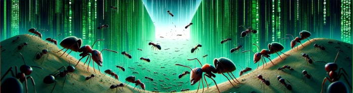

# Ant Food Search Simulation

   

Welcome to our Ant-Simulation-Project, an interactive simulation of an ants food search. This project uses algorithms to simulate how ants find food and navigate through their environment. Whether you're a biology enthusiast, an educator, or just curious, our easy-to-follow instructions will help you run your own simulations and discover the intricacies of ant behavior.

## Installation

To get started, follow these steps:

1. **Clone the repository**

```bash
git clone https://github.com/heyitsalina/ant_search_algorithm.git
```

2. **Navigate to the Project directory**

```bash
cd ant_search_algorithm/
```

3. **Create a virtual environment** (We recommend you to create a virtual environment to install the dependencies. If you dont want to, continue with 4.)

```bash
python -m venv venv
```

- Activate the virtual environment:

  - On Windows: `venv\Scripts\activate`
  - On Unix or MacOS: `source venv/bin/activate`

4. **Install the dependencies**

```bash
pip install .
```

## Run Locally

To run the simulation from the project directory, execute:

```bash
python -m resources.gui
```

## Demo

How the Ant-Simulation works:

A demonstration of the basic functions of Ant Simulation:


A demonstration of the advanced functions of Ant Simulation:


This ant food search simulation offers an intuitive GUI to interact with the simulation. It allows you to directly influence the simulation environment and observe the complex behaviors of ants in their quest for food. Here’s how you can interact with the simulation:

- **Placing Entities**: To add food sources or ant colonies to the simulation, click on the respective symbols for food and ants located in the bottom left corner of the GUI. Then, click on the desired location on the map to place them. This method allows for easy customization of the simulation's starting conditions. You can place several.

- **Updating Entity Parameters**: You can tailor the simulation to your specific interests by adjusting entity parameters. Double-click on any placed entity (food or colony) to open its settings.

  - **Food Settings**:
    - **Amount of Food**: Specify how much food is available at a food object. This value determines how long the food will last as ants collect it.
    - **Show Life Bar**: Toggle the visibility of a life bar that dynamically represents the remaining amount of food at each food source.
  
  - **Colony Settings**:
    - **Number of Ants**: Set the initial number of ants in a colony.
    - **Step Size**: Adjust the speed at which ants move across the map.
    - **Amount to Carry**: Define how many pieces of food an ant can carry back to the colony from a food source.
    - **Color**: Choose the color of your ant colony for easy identification.
    - **Pheromone Grid**: Configure the shape and size of the pheromone grid, which affects how ants navigate to food sources and back to the colony.

- **Simulation Controls**: The simulation can be dynamically controlled using the **start**, **stop**, and **clear** buttons located within the GUI. Use these to begin the simulation, pause or stop the action to make adjustments, or reset the environment for a new setup.

- **Settings and View**: Customize your simulation experience further with additional settings and view options:
  - In the top right corner, access the settings menu to disable sound.
  - You can zoom to focus on specific areas of interest within the simulation. If you need to reset your view, simply click the **Adjust View** button to return to the default perspective.
  - The window size can be adjusted from the bottom right corner.

Experiment with different configurations and observe how each change affects the behavior and efficiency of the ant colonies. The Ant Simulation Project is designed to be a versatile tool for exploring the fascinating dynamics of ant behavior and food search strategies.

## Contribute

We welcome contributions to our Ant Food Search Simulation project! To ensure that our project remains high-quality and coherent, we have documented the architecture and code extensively. Here’s how you can get started:

### Familiarize Yourself with the Project

- **Project Structure:** We have included a diagram of the project structure in the repository to help you understand how the project is organized.
- **Code Documentation:** The classes, methods, and parameters are thoroughly described using docstrings in the code files. This documentation is your go-to resource for understanding the functionality and purpose of the code.

### How to Contribute

1. Clone/Fork the repository.
2. Create a new branch for your feature (`git checkout -b AmazingFeature`).
3. Commit your changes (`git commit -m 'Add some AmazingFeature'`).
4. Push to the branch (`git push origin AmazingFeature`).
5. Open a Pull Request.

### Stay Updated

- **Pull the Latest Changes:** Regularly update your forked repository with the latest changes from the main project to avoid merge conflicts and stay up-to-date with the development.

### Need Help?

If you have any questions, encounter issues or need assistance please don't hesitate to contact us by opening an issue. This is also the perfect place to share your ideas or ask for help with any errors or questions you might have.

We appreciate your interest in contributing to the Ant Food Search Simulation project. Your contributions help us build a better project for everyone. We look forward to your amazing features and improvements!

## License

This project is licensed under the MIT License - see the LICENSE file for details.

## Authors

- [@AlhaririAnas](https://www.github.com/AlhaririAnas)
- [@Jonah-gr](https://www.github.com/Jonah-gr)
- [@heyitsalina](https://www.github.com/heyitsalina)
- [@honnigmelone](https://www.github.com/honnigmelone)
- [@tis22](https://www.github.com/tis22)
